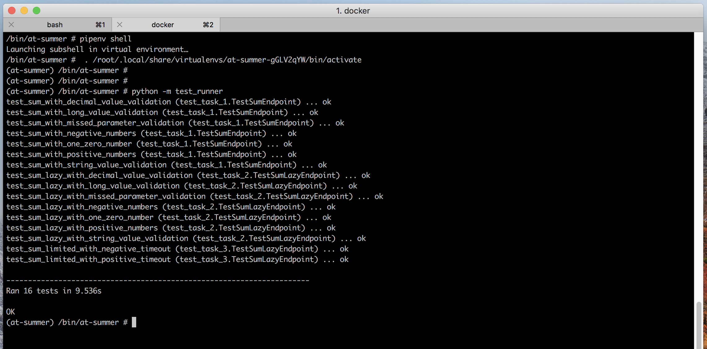

# python_docker_api_tests_integration_template:
This is a project to show how python-api tests running could be implemented with docker

# Requirements
`docker` and `docker-compose`

# Setup
```bash
git clone git@github.com:asket888/python_docker_api_tests_integration_template.git
```

# Command line Execution:
1. navigate to project directory
2. run docker container
```bash
docker-compose build
docker-compose up -d
```
3. open at-summer_summer_1 container terminal (one option is to use Kinematic -> at-summer_summer_1 -> execute)
4. type in docker terminal to run pipenv shell `pipenv shell`
5. type in docker terminal to run tests `python -m test_runner`

# Test result screen shot:

